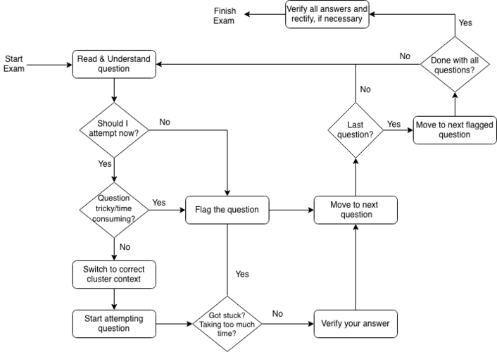

# What is __Kubernetes__(K8S)?

## [Tips to ace the CKA and CKAD exams](https://www.civo.com/learn/tips-to-ace-cka-and-ckad-exams)

__Resources as given in the above articles__

A- Course Links:

- [CKA Udemy](https://www.udemy.com/course/certified-kubernetes-administrator-with-practice-tests/)

- [CKED Udemy](https://www.udemy.com/course/certified-kubernetes-application-developer/)

B- Practice Questions:

- [CKA-practice-exercises](https://github.com/alijahnas/CKA-practice-exercises)
- [Kubernetes CKA Example Exam Questions Practical Challenge](https://levelup.gitconnected.com/kubernetes-cka-example-questions-practical-challenge-86318d85b4d)

- [CKAD-exercises](https://github.com/dgkanatsios/CKAD-exercises)
- [CKAD-Practice-Questions](https://github.com/bbachi/CKAD-Practice-Questions)
- [Kubernetes CKAD Example Exam Questions Practical Challenge Series](https://codeburst.io/kubernetes-ckad-weekly-challenges-overview-and-tips-7282b36a2681)

C- Exam Tips 

- [kubectl Cheat Sheet](https://kubernetes.io/docs/reference/kubectl/cheatsheet/)
- [Kubectl autocomplete](https://kubernetes.io/docs/reference/kubectl/cheatsheet/#kubectl-autocomplete)
- [cka-ckad-bookmarks](https://gist.github.com/milindchawre/3558fabd7ee9ed72123d4be5b23f338c)
- [Kubernetes Documentation](https://kubernetes.io/docs/home/) 
- [Exam User Interface](https://docs.linuxfoundation.org/tc-docs/certification/lf-candidate-handbook/exam-user-interface)

- [curriculum](https://github.com/cncf/curriculum)
- [Important Instructions: CKA and CKAD](https://docs.linuxfoundation.org/tc-docs/certification/tips-cka-and-ckad)
 

